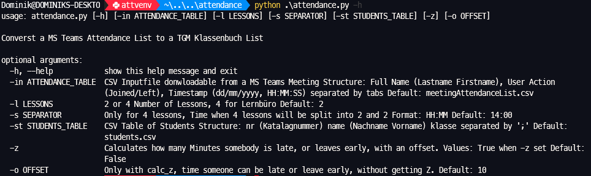
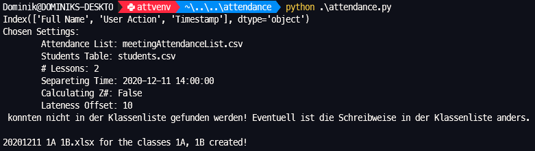

# Teams Attendance Klassenbuch Writer
Creates a TGM Klassenbuch Excel Table out of MS Teams Meeting Attendance List

students.csv has to be crated once with all the students you are planing to work with. They can be copied from the Klassenbuch and the class added.
The attendance list can be downloaded from a MS Teams meeting. It is recommeded to download it just bevor the end of the lesson, so the Z number can be calculated.
Sometimes Students have different names in MS Teams than in the Klassenbuch. The program shows not found students. The students name can then be edited in the students.csv. The program can then be rerun.

Programm Arguments:
```
usage: attendance.py [-h] [-in ATTENDANCE_TABLE] [-l LESSONS] [-s SEPARATOR] [-st STUDENTS_TABLE] [-z] [-o OFFSET]

Converst a MS Teams Attendance List to a TGM Klassenbuch List

optional arguments:
  -h, --help            show this help message and exit
  -in ATTENDANCE_TABLE  CSV Inputfile donwloadable from a MS Teams Meeting Structure: Full Name (Lastname Firstname), User Action
                        (Joined/Left), Timestamp (dd/mm/yyyy, HH:MM:SS) separated by tabs Default: meetingAttendanceList.csv
  -s SEPARATOR          Only for 4 lessons, Time when 4 lessons will be split into 2 and 2 Format: HH:MM Default: 14:00
  -st STUDENTS_TABLE    CSV Table of Students Structure: nr (Katalognummer) name (Nachname Vorname) klasse separated by ';' Default:
                        students.csv
  -z                    Calculates how many Minutes somebody is late, or leaves early, with an offset. Values: True when -z set Default:
                        False
  -o OFFSET             Only with calc_z, time someone can be late or leave early, without getting Z. Default: 10
```




